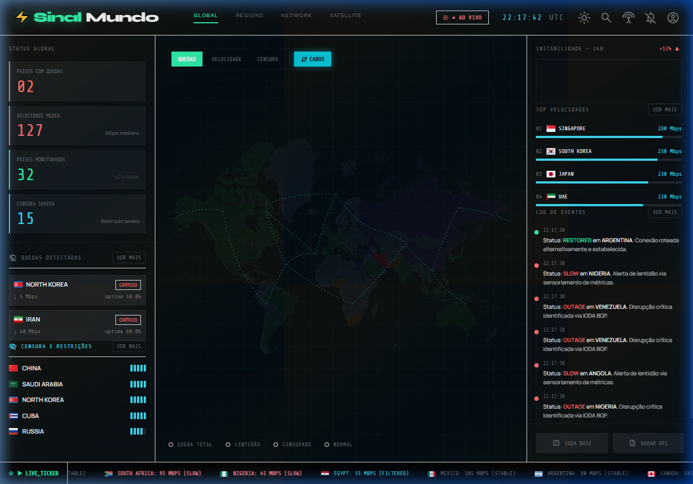
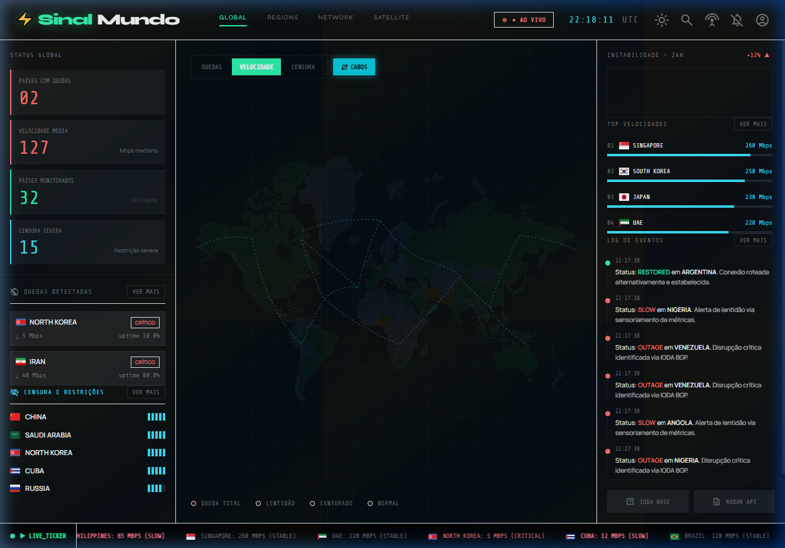
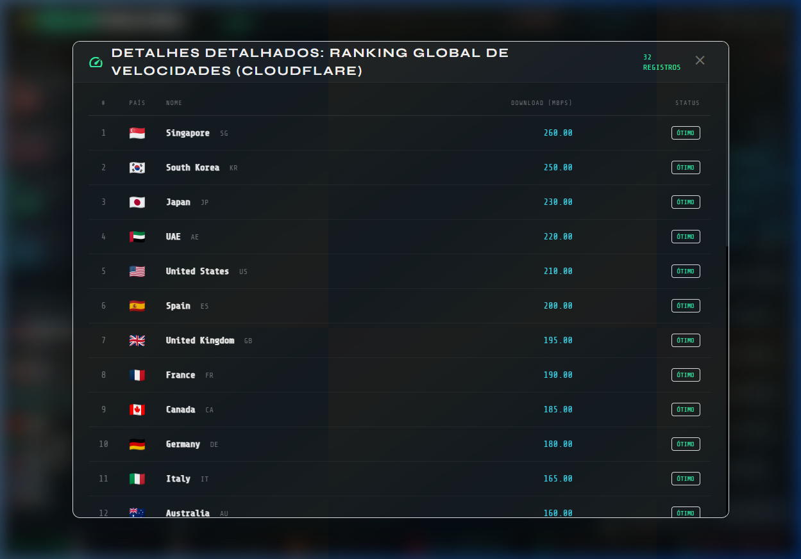
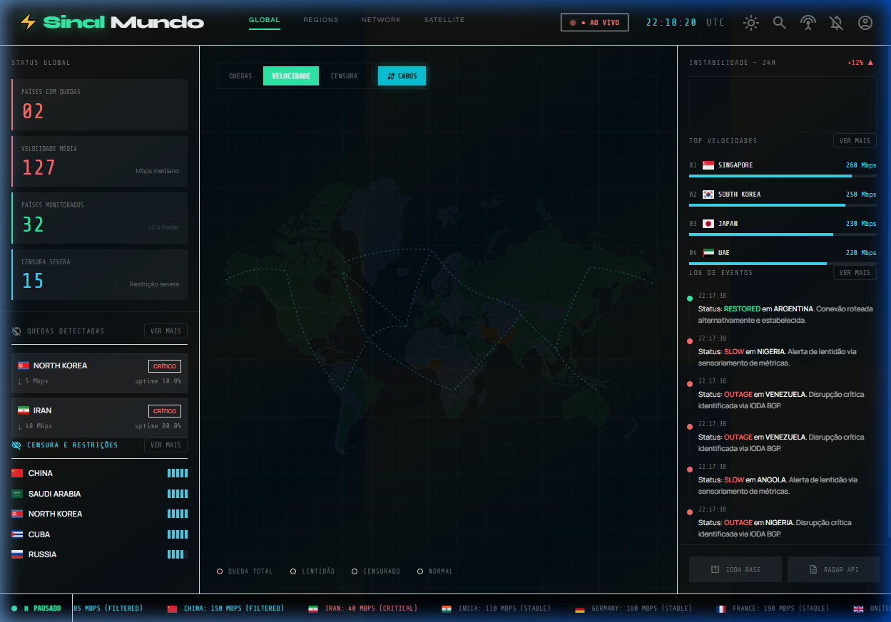

<div align="center">

# ⚡ SinalMundo

**Painel global de monitoramento em tempo real do status da internet mundial.**  
Quedas, censura, velocidade e eventos — tudo num único dashboard ao vivo.

[](https://sinalmundo.pages.dev/)
[](https://angular.dev/)
[](https://www.typescriptlang.org/)
[](https://pages.cloudflare.com/)

### 🌐 [sinalmundo.pages.dev](https://sinalmundo.pages.dev/)

</div>

---



---

## ✨ Funcionalidades

| Feature | Descrição |
|---|---|
| 🗺️ **Mapa SVG Interativo** | Mapa mundial renderizado em SVG puro, sem bibliotecas externas. Clique em países para detalhes. |
| 📡 **Live Ticker** | Barra inferior com scroll automático mostrando o status de todos os países em tempo real. Hover pausa a animação. |
| 📊 **Painéis Laterais** | Quedas ativas, censura e restrições, ranking de velocidade e log de eventos em tempo real. |
| 🔍 **Modal "Ver Mais"** | Drill-down completo em cada seção: tabela detalhada com todos os registros, ordenados e classificados. |
| 🌐 **Cabos Submarinos** | Visualização das rotas de cabos submarinos intercontinentais sobre o mapa. |
| 🔎 **Busca Global (Ctrl+K)** | Pesquisa rápida de países por nome ou código ISO. |
| 🔔 **Alertas Sonoros** | Notificações de browser e beep sonoro a cada novo evento crítico. |
| 🎨 **3 Modos de Mapa** | Visualize o mundo por Quedas, Velocidade ou Censura com cores distintas. |

---

## 📸 Screenshots

### Dashboard Principal — Modo Quedas


### Mapa em Modo Velocidade



### Modal "Ver Mais" — Ranking Global de Velocidades



### Live Ticker com Hover-to-Pause



---

## 🏗️ Arquitetura

```
src/
├── app/
│   ├── core/
│   │   ├── models/          # Tipagens: CountryStatus, Outage, EventLog, MapMode
│   │   ├── services/        # InternetStatusService (polling), IODA, Cloudflare Radar
│   │   ├── state/           # app.state.ts — Signals globais (countriesState, mapMode, eventLog...)
│   │   └── interceptors/    # Cache interceptor (evita re-fetch durante polling)
│   ├── features/
│   │   ├── dashboard/       # Layout principal — CSS Grid 3 colunas
│   │   ├── map/             # WorldMapComponent — SVG puro com Renderer2
│   │   ├── panels/          # StatsPainel, OutageList, CensorshipList, SpeedRanking, EventLog
│   │   │   ├── full-list-modal/       # Modal drill-down universal (speed/outages/censorship/logs)
│   │   │   └── country-detail-modal/ # Modal de detalhe por país
│   │   └── ticker/          # TickerComponent com hover-to-pause
│   └── shared/
│       ├── pipes/           # MbpsPipe, UptimePipe, TimeAgoPipe
│       └── components/      # StatusBadge, SeverityBar, PulseDot, LoadingSkeleton
└── environments/
    └── environment.ts       # Tokens de API (IODA / Cloudflare Radar)
```

---

## 🚀 Stack Técnica

- **[Angular 21](https://angular.dev/)** — Standalone Components, Control Flow (`@if`, `@for`, `@defer`)
- **Signals** — Estado reativo global via `signal()`, `computed()` e `effect()` nativos
- **Zoneless** — `provideExperimentalZonelessChangeDetection()` para renderização ultra-otimizada
- **SVG Puro** — Mapa mundial interativo sem nenhuma biblioteca de mapas
- **CSS Grid + Custom Properties** — Layout responsivo zero-dependência
- **Cloudflare Pages** — Deploy estático com CDN global

---

## ⚙️ Instalação e Execução Local

```bash
# Clone o repositório
git clone https://github.com/newericg/sinalmundo.git
cd sinalmundo

# Instale as dependências
npm install

# Rode o servidor de desenvolvimento
npm start
```

Acesse em: **http://localhost:4200**

---

## 🔑 Configuração de APIs

A aplicação funciona com dados simulados (mock) por padrão. Para conectar às APIs reais, edite `src/environments/environment.ts`:

```typescript
export const environment = {
  iodaApiKey: 'SEU_TOKEN_IODA',       // https://ioda.caida.org
  cloudflareToken: 'SEU_TOKEN_CF',    // https://radar.cloudflare.com/api
};
```

| API | Dado | Link |
|---|---|---|
| [IODA (CAIDA)](https://ioda.caida.org) | Detecção de quedas de internet por BGP e DNS | [Docs](https://api.ioda.caida.org/) |
| [Cloudflare Radar](https://radar.cloudflare.com/) | Velocidade, qualidade e tráfego DNS | [Docs](https://developers.cloudflare.com/radar/) |
| [Freedom House](https://freedomhouse.org/) | Índice de censura e liberdade na internet | [Dados](https://freedomhouse.org/report/freedom-net) |

---

## ☁️ Deploy (Cloudflare Pages)

| Campo | Valor |
|---|---|
| **Build command** | `npm run build` |
| **Build output directory** | `dist/sinalmundo/browser` |
| **Node.js version** | `20` |

---

<div align="center">

Feito com ⚡ e muito café · Deploy em [sinalmundo.pages.dev](https://sinalmundo.pages.dev/)

</div>
